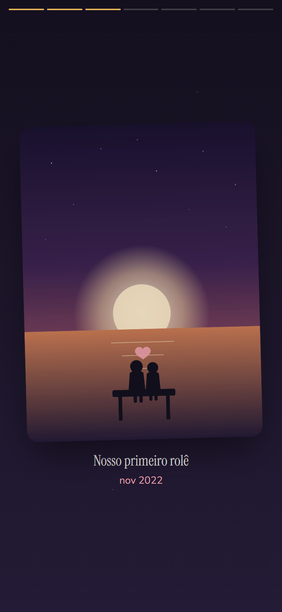
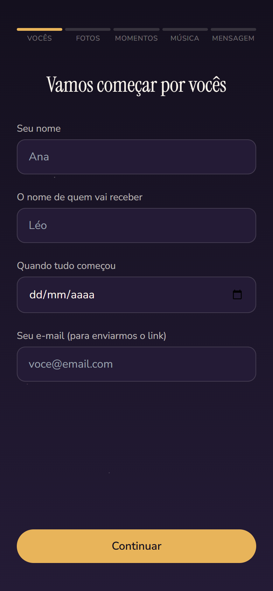

# Nossa Retro 💛

> A história de vocês, contada como merece.

Micro-SaaS de retrospectivas de relacionamento: o comprador monta uma
retrospectiva animada com as fotos, os momentos e a música do casal, paga
**R$ 19,90 via Pix** e recebe um link eterno + QR code para presentear —
pronto para esconder num cartão, numa caixa ou num buquê.

<p align="center">
  
  
  
</p>
<p align="center">
  
</p>

## Como funciona

1. **Cria** — formulário em 5 etapas (nomes/data, fotos, momentos, música,
   mensagem final), com prévia real da retrospectiva antes de pagar.
2. **Paga** — QR code Pix na tela; a confirmação aparece sozinha em
   segundos, sem recarregar a página.
3. **Presenteia** — link exclusivo e permanente + QR code para download,
   entregues na tela e por e-mail.

A retrospectiva abre em formato *story* (toque para avançar), com contador
ao vivo do tempo juntos, embed de Spotify/YouTube e respeito a
`prefers-reduced-motion`.

## Stack

| Camada | Tecnologia |
| --- | --- |
| Framework | Next.js 14 (App Router) + TypeScript |
| UI | Tailwind CSS + Framer Motion |
| Banco + storage | Supabase (Postgres com RLS + bucket público) |
| Pagamento | Mercado Pago — **Orders API** (Pix) |
| E-mail transacional | Resend |
| Hospedagem | Vercel |

## Decisões de arquitetura

- **Sem login** — menos fricção na compra; o comprador é identificado pelo
  e-mail. Rascunhos ficam no `localStorage` **e** no banco, retomáveis.
- **Escrita só pelo servidor** — o client nunca fala direto com o banco:
  RLS ligado e toda escrita passa pelas API routes com service role.
- **Confirmação de pagamento em duas vias** — webhook (com validação da
  assinatura `x-signature`) **e** polling que consulta o Mercado Pago
  diretamente. Webhook perdido não trava a entrega, e em localhost o
  fluxo completo funciona sem ngrok.
- **Sandbox transparente** — fora de https, o checkout se adapta ao
  ambiente de teste do MP (pagador `@testuser.com` + nome `APRO`, que
  aprova o Pix automaticamente em segundos).
- **Fotos comprimidas no navegador** antes do upload
  (`browser-image-compression`) — menos banda, storage e espera.
- **Links não indexáveis** (`noindex`) com slugs aleatórios de 12
  caracteres; rascunhos expiram em 7 dias, retrospectivas pagas são
  permanentes (argumento de venda).

## Rodando localmente

```bash
npm install
cp .env.example .env.local   # preencha as chaves (veja abaixo)
npm run dev
```

`/`, `/r/demo` e `/criar` funcionam de cara, sem chave nenhuma. Para o
fluxo completo (upload, rascunho no banco, Pix, e-mail):

1. **Supabase** — crie um projeto, rode `supabase/schema.sql` no SQL
   Editor, crie um bucket público `fotos` e copie URL + chaves
   (Project Settings → API).
2. **Mercado Pago** — crie uma aplicação em
   [developers](https://www.mercadopago.com.br/developers) e use o Access
   Token **de teste** no `MP_ACCESS_TOKEN`. O pagamento de teste aprova
   sozinho em segundos.
3. **Resend** — crie a conta, verifique seu domínio (SPF/DKIM) e preencha
   `RESEND_API_KEY` e `EMAIL_FROM`.

## Deploy

1. Importe o repositório na [Vercel](https://vercel.com) e configure as
   variáveis de ambiente (com `NEXT_PUBLIC_APP_URL` em https e credenciais
   de **produção** do MP, homologadas).
2. No painel do MP, configure o webhook (tópico *orders*) apontando para
   `/api/webhook` e copie a assinatura secreta para `MP_WEBHOOK_SECRET`.
3. Agende a limpeza de rascunhos expirados (cron do Supabase — SQL de
   exemplo em `supabase/schema.sql`).

---

Projeto comercial em desenvolvimento — feito com ❤️ no Brasil.
Código público apenas para fins de portfólio; todos os direitos
reservados (veja [LICENSE](LICENSE)).
